# FairHire AI - Complete Project Flowcharts
# Open each mermaid block at https://mermaid.live

---

## FLOWCHART 1 - Full System Architecture

```mermaid
flowchart TD
    subgraph CLIENT["FRONTEND - React + TypeScript + Vite"]
        LAND[Landing Page]
        LOGIN[Login Page - Email/Password - Google OAuth]
        DASH[Dashboard - Metrics + Analytics]
        JOBS[Jobs Page - Create / Publish]
        PIPE[Pipeline Page - Stage Management]
        CANDS[Candidates Page]
        PROF[Candidate Profile]
        INTV[Interviews Page]
        PROC[Process Resumes]
        CHAT[RecruiterChat - Floating Widget]
    end

    subgraph AUTH_FLOW["AUTH LAYER"]
        JWT[JWT Token - HS256 - 8hr expiry]
        GOOG[Google OAuth2 - Authorization Code Flow]
    end

    subgraph BACKEND["BACKEND - FastAPI + asyncpg"]
        subgraph ROUTES["API Routes /api/v1/"]
            R_AUTH[auth - register login google]
            R_JOBS[jobs - CRUD publish]
            R_UPLOAD[upload/resume - Parse + Profile]
            R_MATCH[match/jd - Fit Scoring]
            R_APPS[applications - Pipeline CRUD]
            R_INTV[interviews - Schedule + Score]
            R_CHAT[chat - Chatbot]
            R_ANAL[analytics/summary]
            R_INTAKE[intake/submit - Public API]
            R_APPLY[apply/job_id - Public HTML Form]
        end

        subgraph SERVICES["Services Layer"]
            SVC_PARSE[parser.py - pypdf to pdfplumber]
            SVC_PROF[profile_extractor.py - Regex Pipeline]
            SVC_JD[jd_matcher.py - Hybrid Scoring]
            SVC_SEM[semantic_matcher.py - BM25 TF-IDF]
            SVC_IMP[scoring_service.py - Impact Scorer]
            SVC_TAX[skill_taxonomy.py - 80+ Skills]
            SVC_DEC[decision_engine.py - Hire/Hold/Reject]
            SVC_EMAIL[email_service.py - Brevo/Resend/SMTP]
            SVC_JDO[jd_optimizer.py - JD Quality]
            SVC_QUAL[resume_quality.py - 0-100 Score]
            SVC_LINK[link_verifier.py - GitHub/LinkedIn]
        end
    end

    subgraph DB["PostgreSQL - 6 Tables"]
        T_USERS[(hr_users)]
        T_JOBS[(jobs)]
        T_CANDS[(candidates)]
        T_APPS[(applications)]
        T_INTV[(interviews)]
        T_FORMS[(form_submissions)]
    end

    LOGIN -->|email + password| R_AUTH
    LOGIN -->|OAuth code| GOOG
    GOOG -->|exchange code| R_AUTH
    R_AUTH --> JWT
    JWT -->|stored in localStorage| CLIENT

    PROC --> R_UPLOAD
    JOBS --> R_JOBS
    PIPE --> R_APPS
    CANDS --> R_MATCH
    INTV --> R_INTV
    CHAT --> R_CHAT
    DASH --> R_ANAL

    R_UPLOAD --> SVC_PARSE
    SVC_PARSE --> SVC_PROF
    SVC_PROF --> SVC_TAX
    SVC_PROF --> SVC_LINK
    SVC_PROF --> SVC_QUAL

    R_MATCH --> SVC_JD
    SVC_JD --> SVC_SEM
    SVC_JD --> SVC_IMP
    SVC_JD --> SVC_TAX

    R_APPS --> SVC_DEC
    R_APPS --> SVC_EMAIL
    R_CHAT --> SVC_DEC
    R_CHAT --> SVC_JDO

    R_APPLY --> R_INTAKE
    R_INTAKE --> SVC_PROF
    R_INTAKE --> SVC_JD
    R_INTAKE --> SVC_EMAIL

    BACKEND --> DB
```

---

## FLOWCHART 2 - Server Startup Sequence

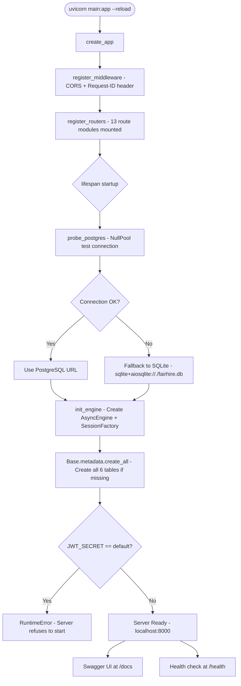

---

## FLOWCHART 3 - Authentication Flow

```mermaid
flowchart TD
    subgraph EMAIL_AUTH["Email and Password Auth"]
        A1[User fills Login form] --> B1{Mode?}
        B1 -->|Register| C1[POST /auth/register - email password full_name]
        B1 -->|Login| D1[POST /auth/login - OAuth2PasswordRequestForm]
        C1 --> E1[hash_password - passlib bcrypt]
        E1 --> F1[Save HRUser - role hardcoded = hr]
        D1 --> G1[verify_password - bcrypt compare]
        G1 -->|Match| H1[create_access_token - python-jose HS256]
        F1 --> H1
        H1 --> I1[Return JWT - user_id email role]
        I1 --> J1[Store in localStorage - quantumlogic_token]
    end

    subgraph GOOGLE_AUTH["Google OAuth2 Flow"]
        A2[Click Continue with Google] --> B2[Redirect to accounts.google.com - scope openid email profile]
        B2 --> C2[User picks Google account]
        C2 --> D2[Google redirects to /auth/google/callback?code=XXX]
        D2 --> E2[GoogleCallback.tsx - extracts code from URL]
        E2 --> F2[POST /auth/google - credential: code]
        F2 --> G2[httpx POST to oauth2.googleapis.com/token - exchange code for id_token]
        G2 --> H2[id_token.verify_oauth2_token - google-auth library]
        H2 -->|Valid| I2{User exists?}
        I2 -->|No| J2[Create HRUser - role = hr]
        I2 -->|Yes| K2[Fetch existing user]
        J2 --> L2[create_access_token]
        K2 --> L2
        L2 --> M2[Return JWT]
        M2 --> N2[Navigate to /dashboard]
    end

    subgraph PROTECTED["Every Protected Request"]
        P1[Request with Authorization Bearer TOKEN] --> P2[get_current_user dependency]
        P2 --> P3[decode_token - python-jose]
        P3 -->|Invalid or Expired| P4[401 Unauthorized - Frontend clears localStorage]
        P3 -->|Valid| P5[db.get HRUser by sub]
        P5 --> P6[Route handler executes]
    end
```

---

## FLOWCHART 4 - Resume Upload and Parsing Pipeline

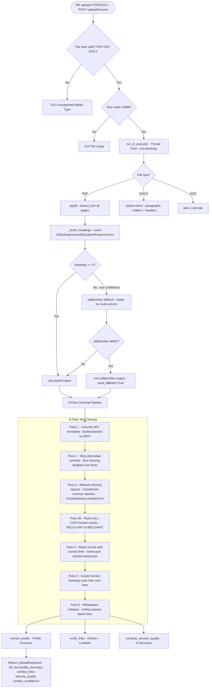

---

## FLOWCHART 5 - Profile Extraction Regex Pipeline

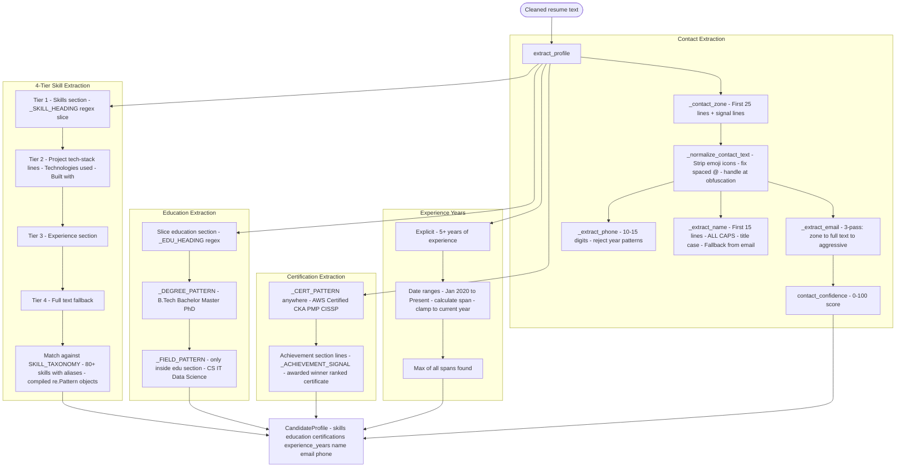

---

## FLOWCHART 6 - AI Fit Scoring Pipeline

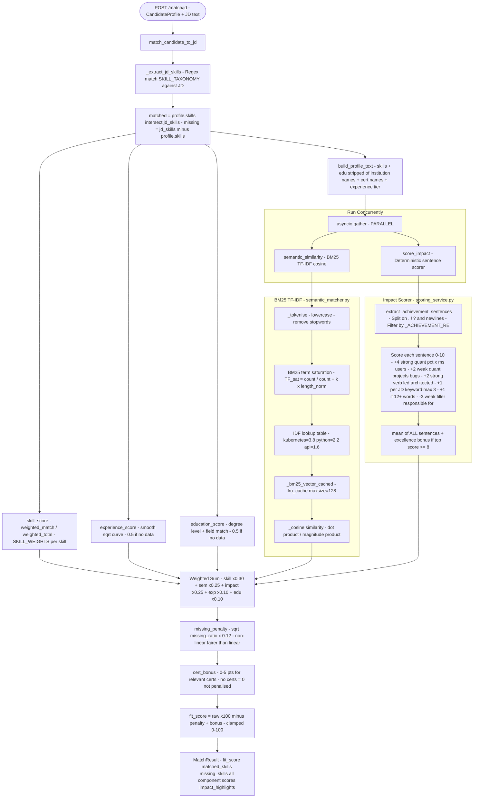

---

## FLOWCHART 7 - Hiring Pipeline Stage Machine

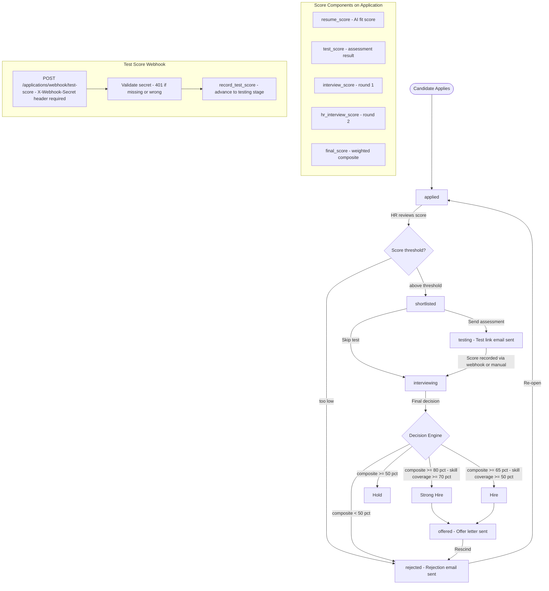

---

## FLOWCHART 8 - Public Application Form Flow

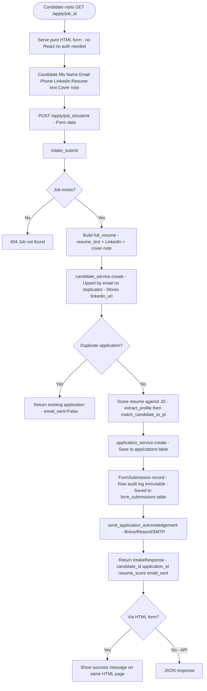

---

## FLOWCHART 9 - Recruiter Chatbot Flow

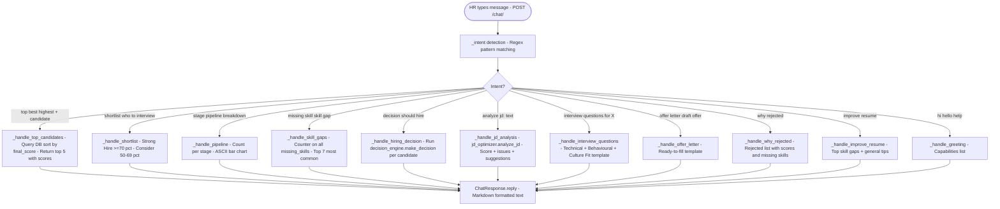

---

## FLOWCHART 10 - Frontend Navigation and State

```mermaid
flowchart TD
    subgraph PROVIDERS["Context Providers wrap entire app"]
        P1[AuthProvider - user token login googleLogin logout - 401 interceptor]
        P2[JobProvider - active job persisted in localStorage]
        P3[PipelineProvider - pipeline stage data]
    end

    A([User visits app]) --> B{isAuthenticated?}
    B -->|No| C[Landing Page /]
    C --> D[Login Page /login]
    D -->|Email/Password| E[AuthContext.login - POST /auth/login]
    D -->|Google button| F[Redirect to Google OAuth]
    F --> G[/auth/google/callback - GoogleCallback.tsx - spinner while processing]
    G --> H[AuthContext.googleLogin - POST /auth/google]

    E --> I[JWT stored - Navigate to /dashboard]
    H --> I
    B -->|Yes| I

    I --> J[Dashboard - Metrics Score distribution Top candidates AI insights]
    J --> K[Jobs Page - Create job Set JD Publish]
    K --> L[Process Resumes - Upload PDF/DOCX - See profile + score]
    L --> M[Pipeline Page - Stage-grouped table - Advance Reject Offer]
    M --> N[Candidates Page - All candidates list]
    N --> O[Candidate Profile - Full details scores links]
    M --> P[Interviews Page - Schedule Score rounds]
    J --> Q[RecruiterChat - Floating widget - always visible when logged in]

    subgraph AXIOS["Axios API Client - services/api.ts"]
        AX1[Base URL: /api/v1]
        AX2[JWT injected in Authorization header]
        AX3[401 response clears auth - auto logout]
    end
```

---

## FLOWCHART 11 - Email Notification System

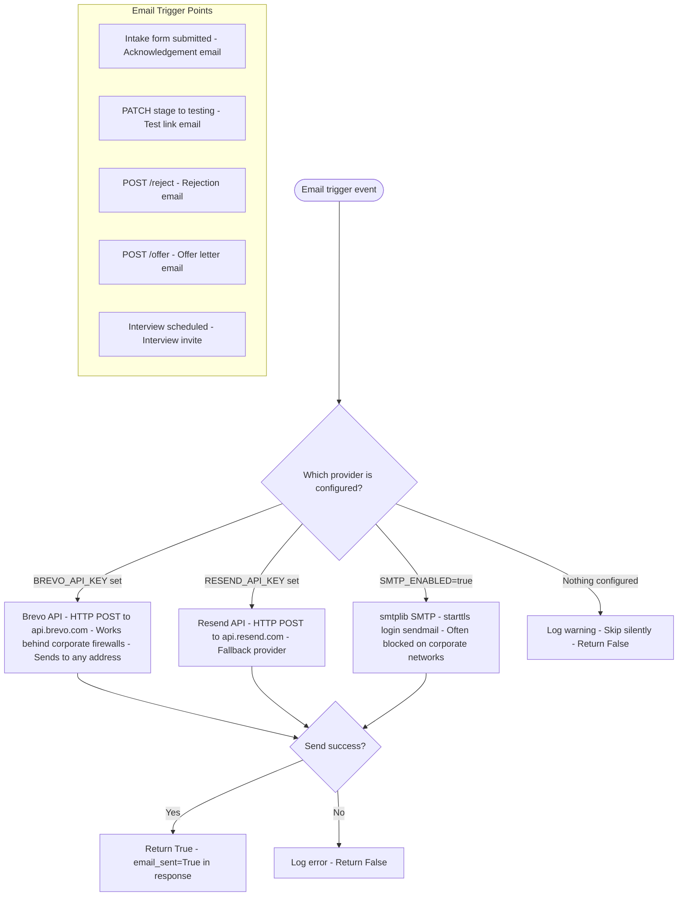

---

## FLOWCHART 12 - Database Write Flow

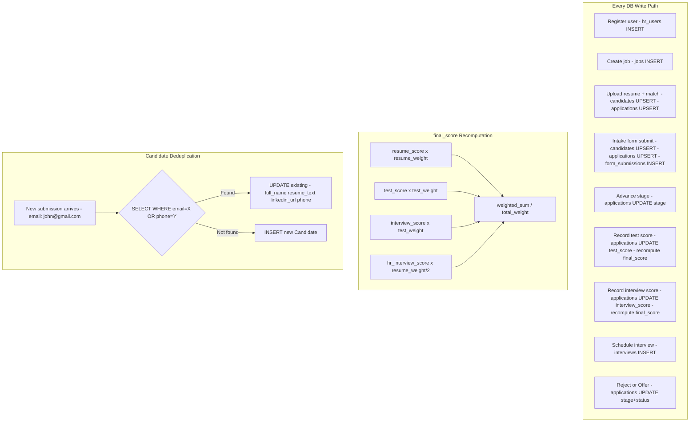
